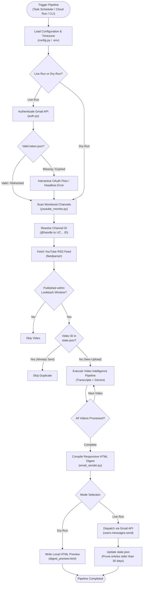
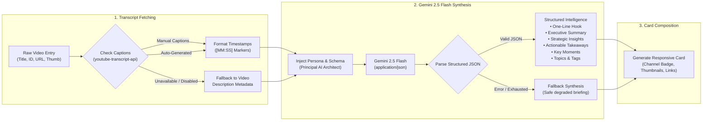

# YouTube Insight Digest 📺🤖📬

[](https://www.python.org/downloads/)
[](https://ai.google.dev/)
[](https://developers.google.com/gmail/api)
[](https://cloud.google.com/run)
[](LICENSE)

An automated intelligence system that monitors premier YouTube technical channels (**AI Engineer**, **LangChain**, **SuperDataScience**, **AWS Developers**), extracts video transcripts and metadata, synthesizes executive summaries and strategic insights using **Google Gemini**, and dispatches a responsive HTML digest to your **Gmail** every day at **12:00 PM Japan Standard Time (JST)**.

---

## 🌟 Key Highlights

- **Quota-Free & High Reliability**: Monitors channels via public RSS feeds (`feedparser`) and resolves `@handles` dynamically. Zero YouTube Data API quota consumption.
- **Deep Multilingual Transcripts**: Extracts manual or auto-generated video captions with timestamps via `youtube-transcript-api` across English, Japanese, Korean, and more.
- **Gemini Intelligence Engine**: Generates high-signal briefings:
  - **One-Line Hook**: A razor-sharp 1-sentence synthesis of the core breakthrough or thesis.
  - **Executive Summary**: 3–5 dense bullet points detailing architectures, tools, and benchmark results.
  - **Strategic Insights**: Deep analytical takeaways on industry implications and architectural tradeoffs.
  - **Actionable Takeaways**: Concrete engineering and operational next steps for AI practitioners.
  - **Key Moments**: Timestamped milestones (`[MM:SS]`) with context and direct video links.
- **Responsive Gmail Digest**: Modern typography, dynamic channel badge pills, embedded thumbnails, and clean cards designed for mobile and desktop Gmail clients.
- **Duplicate Prevention**: State tracking via `state.json` guarantees each video is summarized and emailed only once, with automatic 30-day pruning.
- **Production-Ready**: Works seamlessly via local CLI, Windows Task Scheduler, or headless Google Cloud Run webhook triggers.

---

## 🏗️ Processing Flowcharts & System Architecture

Visual representation of the end-to-end execution lifecycle, decision branches, and AI intelligence synthesis stages.

### 1. End-to-End Orchestration & Decision Flowchart



### 2. Video Intelligence & Extraction Processing Sub-Pipeline



---

## 📡 Pre-Configured Channels

| Channel | Handle | Category | Focus & Domain |
| :--- | :--- | :--- | :--- |
| **AI Engineer** | `@aiDotEngineer` | AI Engineering | AI Engineering, Latent Space talks, agent architectures |
| **LangChain** | `@LangChain` | LLM Frameworks | LangGraph, autonomous agents, evaluation frameworks |
| **SuperDataScience** | `@sds-superdatascience` | Data Science | Data science, machine learning models, industry interviews |
| **AWS Developers** | `@awsdevelopers` | Cloud & Infrastructure | Cloud infrastructure, serverless AI, Amazon Bedrock |

> [!TIP]
> You can add, disable, or customize channels at any time in [`channels.json`](file:///c:/Users/hyunwookim/OneDrive%20-%20GAFS/%E3%83%89%E3%82%AD%E3%83%A5%E3%83%A1%E3%83%B3%E3%83%88/GitHub/youtube-insight-digest/channels.json). The system automatically resolves `@handles` to internal YouTube channel IDs without requiring manual channel ID lookups.

---

## 📁 Repository Structure

```
youtube-insight-digest/
├── channels.json              # Channel configurations (handles, categories, badges)
├── requirements.txt           # Application dependencies
├── Dockerfile                 # Production container image configuration
├── run_digest.bat             # Windows one-click execution & task scheduler batch file
├── README.md                  # Project documentation & operational reference
├── .env.example               # Environment variables template
├── .gitignore                 # Excludes secrets, tokens, local states, and caches
├── .gcloudignore              # Cloud Build packaging ignore rules
├── deployment/
│   └── deploy_cloud.ps1       # Automated Google Cloud Run & Cloud Scheduler deployment script
├── src/
│   ├── __init__.py            # Package indicator
│   ├── app.py                 # Flask web service for Cloud Run / webhook triggers
│   ├── auth.py                # Gmail OAuth 2.0 flow & automatic token refresh
│   ├── config.py              # Configuration loading, paths, and timezone defaults
│   ├── email_sender.py        # Responsive HTML email builder & Gmail API dispatcher
│   ├── main.py                # CLI pipeline orchestrator & dry-run runner
│   ├── summarizer.py          # Google Gemini structured synthesis & insight generation
│   ├── transcript_fetcher.py  # Subtitle extraction & timestamp alignment
│   └── youtube_monitor.py     # Channel handle resolver, RSS feed parser & state manager
└── tests/
    └── test_monitor.py        # Automated unit and integration test suite
```

---

## ⚙️ Configuration & Environment Variables

Create your local `.env` file by copying [`.env.example`](file:///c:/Users/hyunwookim/OneDrive%20-%20GAFS/%E3%83%89%E3%82%AD%E3%83%A5%E3%83%A1%E3%83%B3%E3%83%88/GitHub/youtube-insight-digest/.env.example):

```bash
copy .env.example .env
```

| Variable | Required | Default | Description |
| :--- | :---: | :--- | :--- |
| `GEMINI_API_KEY` | **Yes** | — | API key from [Google AI Studio](https://aistudio.google.com/) for LLM synthesis. |
| `RECIPIENT_EMAIL` | **Yes** | — | Target email address where the daily digest will be delivered. |
| `RECIPIENT_NAME` | No | `AI Practitioner` | Name shown in the digest email greeting and footer. |
| `TIMEZONE` | No | `Asia/Tokyo` | Operational timezone for date headers and scheduling (UTC+9). |
| `DEFAULT_LOOKBACK_HOURS` | No | `24` | Lookback window in hours when scanning RSS feeds for new uploads. |
| `GCP_PROJECT_ID` | No | — | Google Cloud Project ID (used only for Cloud Run deployments). |
| `GCP_REGION` | No | `asia-northeast1` | Deployment region for Cloud Run and Cloud Scheduler. |
| `SERVICE_NAME` | No | `youtube-insight-digest` | Cloud Run service identifier. |

---

## 🚀 Quickstart Guide

### 1. Clone or Open the Repository
```bash
cd "c:\Users\hyunwookim\OneDrive - GAFS\ドキュメント\GitHub\youtube-insight-digest"
```

### 2. Install Dependencies
```bash
py -3.11 -m pip install -r requirements.txt
```

### 3. Setup Gmail OAuth Credentials
You need a Google OAuth 2.0 client credentials file:
1. Obtain an **OAuth 2.0 Client ID (Desktop Application)** from the [Google Cloud Console](https://console.cloud.google.com/).
2. Save the downloaded JSON file as `credentials.json` in the root of this repository.
3. Run the one-time interactive authorization:
   ```bash
   py -3.11 -m src.main --auth
   ```
   *A browser window will prompt you to grant Gmail send permissions. Once authorized, `token.json` is generated and subsequent runs authenticate automatically.*

---

## 🧪 Testing & Execution

### Test in Dry-Run Mode (No Email Sent)
Scans channels, fetches transcripts, synthesizes insights with Gemini, and writes a rendered HTML preview to [`digest_preview.html`](file:///c:/Users/hyunwookim/OneDrive%20-%20GAFS/%E3%83%89%E3%82%AD%E3%83%A5%E3%83%A1%E3%83%B3%E3%83%88/GitHub/youtube-insight-digest/digest_preview.html) for local verification:
```bash
py -3.11 -m src.main --dry-run
```

### Live Run (Scan & Dispatch Email)
```bash
py -3.11 -m src.main
```

### Filter by Channel
```bash
py -3.11 -m src.main --channel @LangChain --dry-run
```

### Custom Lookback Window
```bash
# Check videos published in the past 48 hours
py -3.11 -m src.main --hours 48
```

### Force Re-Processing (Bypass state.json)
```bash
py -3.11 -m src.main --force --dry-run
```

### Run Unit Tests
```bash
py -3.11 -m unittest discover tests
```

---

## ⏰ Daily Scheduling at 12:00 PM JST

### Method A: Windows Task Scheduler (Recommended for Local Machine)
Register a daily scheduled task using the provided [`run_digest.bat`](file:///c:/Users/hyunwookim/OneDrive%20-%20GAFS/%E3%83%89%E3%82%AD%E3%83%A5%E3%83%A1%E3%83%B3%E3%83%88/GitHub/youtube-insight-digest/run_digest.bat):

1. Open PowerShell or Command Prompt.
2. Register the task:
   ```powershell
   schtasks /Create /TN "YouTubeInsightDigest" /TR "\"c:\Users\hyunwookim\OneDrive - GAFS\ドキュメント\GitHub\youtube-insight-digest\run_digest.bat\"" /SC DAILY /ST 12:00
   ```
3. Verify the task:
   ```powershell
   schtasks /Query /TN "YouTubeInsightDigest"
   ```

### Method B: Linux / Cron (UTC 03:00 = JST 12:00)
```crontab
0 3 * * * cd /path/to/youtube-insight-digest && python -m src.main >> /var/log/youtube_digest.log 2>&1
```

### Method C: Google Cloud Run & Cloud Scheduler
Deploy the containerized service and configure a daily Cloud Scheduler trigger:

1. Review and execute [`deployment/deploy_cloud.ps1`](file:///c:/Users/hyunwookim/OneDrive%20-%20GAFS/%E3%83%89%E3%82%AD%E3%83%A5%E3%83%A1%E3%83%B3%E3%83%88/GitHub/youtube-insight-digest/deployment/deploy_cloud.ps1):
   ```powershell
   .\deployment\deploy_cloud.ps1 -ProjectId "YOUR_GCP_PROJECT_ID" -Region "asia-northeast1"
   ```
2. The deployment script automatically:
   - Builds and deploys the container via Cloud Build and Cloud Run (`src/app.py` on port 8080).
   - Configures a dedicated IAM Service Account (`youtube-scheduler-sa`) with `roles/run.invoker`.
   - Schedules a Cloud Scheduler job triggering `POST /` at `0 12 * * *` with timezone `Asia/Tokyo`.

---

## 🛡️ Security & Privacy Hygiene

- **Strict Secret Exclusion**: [`.gitignore`](file:///c:/Users/hyunwookim/OneDrive%20-%20GAFS/%E3%83%89%E3%82%AD%E3%83%A5%E3%83%A1%E3%83%B3%E3%83%88/GitHub/youtube-insight-digest/.gitignore) strictly excludes `.env`, `credentials.json`, `token.json`, `state.json`, and `digest_preview.html`.
- **Zero Accidental Leaks**: OAuth tokens and API keys remain strictly local to your workstation or secure secret store.
