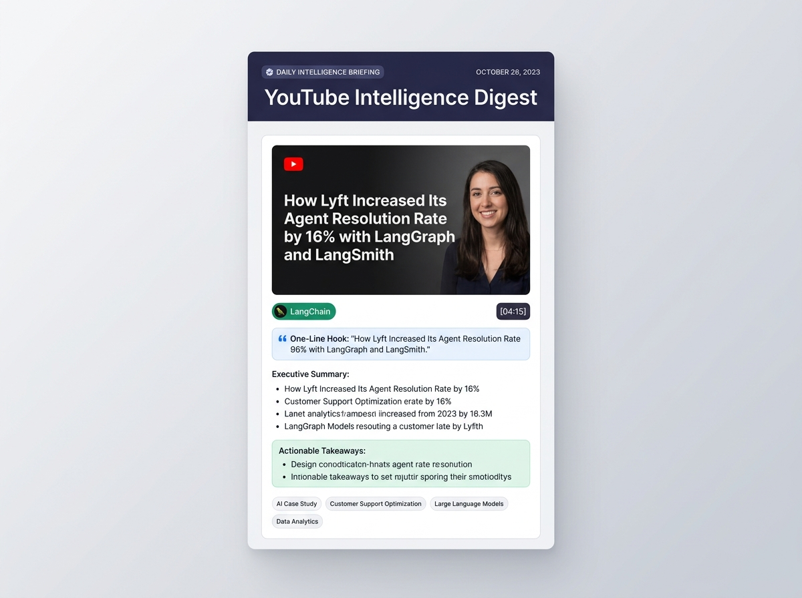
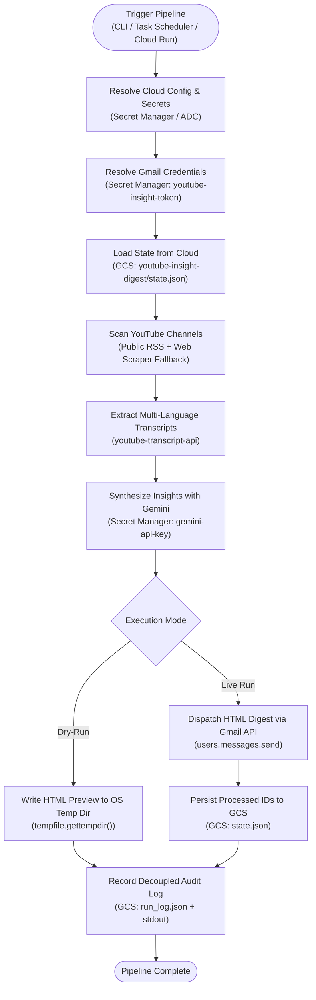

# YouTube Insight Digest 📺🤖📬

[](https://www.python.org/downloads/)
[](https://ai.google.dev/)
[](https://developers.google.com/gmail/api)
[](https://cloud.google.com/)
[](https://cloud.google.com/run)
[](LICENSE)

An automated intelligence system that monitors premier YouTube technical channels (**AI Engineer**, **LangChain**, **SuperDataScience**, **AWS Developers**, **How I AI**), extracts video transcripts and metadata, synthesizes executive summaries and strategic insights using **Google Gemini**, and dispatches a responsive HTML digest to your **Gmail** every day at **12:00 PM Japan Standard Time (JST)**.

Built on a **Cloud-Native, Multi-PC Portable Architecture** using **Google Cloud Secret Manager** and **Google Cloud Storage (GCS)**, eliminating all local secret, token, and state file dependencies.

---

## 📬 Sample Email Digest Preview

Here is an example of the high-signal executive briefing delivered directly to your inbox every day at 12:00 PM JST:

<p align="center">
  
</p>

<details open>
<summary><b>🔍 View Rendered Briefing Card Structure</b></summary>

<br/>

> ### 🟢 LangChain &bull; *LLM Agents & Frameworks*
> **[How Lyft Increased Its Agent Resolution Rate by 16% with LangSmith and LangGraph](https://www.youtube.com/watch?v=M9BMTC8o9-w)**
>
> `💡 One-Line Hook`
> **Lyft increased customer resolution rates by 16% and slashed agent deployment from six months to two weeks using LangGraph and LangSmith.**
>
> **Executive Summary & Strategic Intelligence:**
> - Replaced brittle monolithic prompts with a dynamic meta-agent architecture registering domain-specific sub-agents as LangGraph nodes.
> - Decoupled prompt management via LangSmith Prompt Hub, enabling PMs and ops to ship production agents through simple config updates.
> - Integrated LangSmith tracing across 200k–300k daily queries to pinpoint tool-call failures and hallucinations in multi-turn customer support interactions.
>
> > **Actionable Takeaway:**
> > Decouple agent workflows into config-driven LangGraph nodes and centralized prompt hubs to empower domain experts and accelerate deployment cycles.
>
> **Key Moment:** `[04:15]` Architecture migration breakdown &bull; `Tags:` `#LangGraph` `#MultiAgent` `#LangSmith`

</details>

---

## ☁️ Multi-PC Cloud-Native Architecture

This repository is architected for zero-setup execution across multiple workstations (Windows, macOS, Linux) and headless Google Cloud Run containers without maintaining local secret files:

| Layer | Target Cloud Service | Purpose & Storage Format | Multi-PC Resolution Strategy |
| :--- | :--- | :--- | :--- |
| **API Keys & Secrets** (`GEMINI_API_KEY`, etc.) | **Google Cloud Secret Manager** | Secure string (`secrets/<id>/versions/latest`) | Python SDK with fallback to `gcloud secrets versions access` |
| **OAuth Tokens** (`token.json`) | **Google Cloud Secret Manager** | Serialized JSON token with refresh credentials (`youtube-insight-token`) | Auto-fetched when missing; auto-refreshed in-memory and synchronized back to Secret Manager |
| **OAuth Client IDs** (`credentials.json`) | **Google Cloud Secret Manager** | Raw client secrets JSON (`youtube-insight-credentials`) | Auto-downloaded on demand from Secret Manager only if interactive web login is triggered |
| **Persistent State / Memory** (`state.json`) | **Google Cloud Storage (GCS)** | `gs://<bucket>/youtube-insight-digest/state.json` | Canonical source of truth; local runs write fallbacks strictly to OS temp dir (`tempfile.gettempdir()`) |
| **Execution & Audit Logs** (`run_log.json`) | **Google Cloud Storage & Cloud Logging** | `gs://<bucket>/youtube-insight-digest/run_log.json` + `stdout` | Decoupled from state; structured JSON streamed to Cloud Logging on Cloud Run |

---

## 🌟 Key Highlights

- **Multi-PC Portability**: Any machine with `gcloud auth login` can run the pipeline immediately with zero local `.env`, `credentials.json`, or `token.json` files.
- **Dual-Mode Fallback**: All cloud integrations attempt the Python Google Cloud SDK first, gracefully falling back to authenticated `gcloud` CLI commands.
- **Zero Workspace Litter**: Local state caching and dry-run preview files default strictly to the OS temporary directory (`tempfile.gettempdir()`), keeping the Git repository completely clean.
- **Quota-Free & High Reliability**: Monitors channels via public RSS feeds (`feedparser`) with automatic web-scraping fallback (`ytInitialData`) when YouTube throttles feeds.
- **Resilient Multi-Language Timestamp Ingestion**: Strict publication date verification with multilingual relative time parsing (English, Japanese, Korean, Simplified & Traditional Chinese) and livestream prefix stripping. Unverified dates are safely excluded to guarantee older videos never falsely appear as new uploads.
- **Direct Timestamp Video Linking**: Key moments dynamically compute second offsets and route the `▶ Watch on YouTube` button directly to the exact point in the video (`?t=...`).
- **Self-Healing Channel Resolver**: Auto-recovers canonical YouTube channel IDs dynamically from handles/URLs if a configured channel ID fails or returns 404.
- **Deep Multilingual Transcripts**: Extracts manual or auto-generated video captions with timestamps via `youtube-transcript-api` across English, Japanese, Korean, Chinese, and more.
- **Gemini Intelligence Engine**: Synthesizes high-signal briefings (one-line hooks, executive summaries, strategic insights, actionable takeaways, timestamped key moments).
- **Responsive Gmail Digest**: Clean typography, dynamic channel badge pills, embedded thumbnails, and cards optimized for mobile and desktop Gmail clients.
- **Decoupled Audit Logs**: Structured operational logs are streamed to `stdout` and persisted to Google Cloud Storage.

---

## 🏗️ Orchestration & Cloud Architecture



---

## 📡 Pre-Configured Channels

| Channel | Handle | Category | Focus & Domain |
| :--- | :--- | :--- | :--- |
| **AI Engineer** | `@aiDotEngineer` | AI Engineering | AI Engineering, Latent Space talks, agent architectures |
| **LangChain** | `@LangChain` | LLM Frameworks | LangGraph, autonomous agents, evaluation frameworks |
| **SuperDataScience** | `@sds-superdatascience` | Data Science | Data science, machine learning models, industry interviews |
| **AWS Developers** | `@awsdevelopers` | Cloud & Infrastructure | Cloud infrastructure, serverless AI, Amazon Bedrock |
| **How I AI** | `@howiaipodcast` | AI Podcast & Interviews | AI podcasts, founder interviews, practical AI workflows |

> [!TIP]
> You can add, disable, or customize channels at any time in [`channels.json`](channels.json). The system automatically resolves `@handles` to internal YouTube channel IDs.
>
> *Note for Cloud Deployments:* Because `channels.json` is packaged into the container image at build time, changes require redeploying the Cloud Run service (`.\deployment\deploy_cloud.ps1`) for the scheduled cloud pipeline to reflect the updates.

---

## 📁 Repository Structure

```
youtube-insight-digest/
├── channels.json              # Channel configurations (handles, categories, badges)
├── requirements.txt           # Application dependencies (including Google Cloud SDKs)
├── Dockerfile                 # Production container image (zero baked secrets)
├── run_digest.bat             # Windows one-click execution & task scheduler batch file
├── README.md                  # Project documentation & operational reference
├── .env.example               # Environment variables template (optional local overrides)
├── .gitignore                 # Excludes secrets, tokens, local states, and caches
├── .gcloudignore              # Cloud Build packaging ignore rules
├── deployment/
│   └── deploy_cloud.ps1       # Automated Google Cloud Run & Cloud Scheduler deployment script
├── src/
│   ├── __init__.py            # Package indicator
│   ├── app.py                 # Flask web service for Cloud Run / webhook triggers
│   ├── auth.py                # Cloud-native Gmail OAuth flow & Secret Manager token sync
│   ├── config.py              # Dynamic Secret Manager resolution & cloud configurations
│   ├── email_sender.py        # Responsive HTML email builder & Gmail API dispatcher
│   ├── main.py                # CLI pipeline orchestrator & dry-run runner
│   ├── storage.py             # Google Cloud Storage state & decoupled audit logging module
│   ├── summarizer.py          # Google Gemini structured synthesis & insight generation
│   ├── sync_secrets.py        # One-shot secret & state synchronization utility
│   ├── transcript_fetcher.py  # Subtitle extraction & timestamp alignment
│   └── youtube_monitor.py     # Channel handle resolver, RSS parser & cloud state integration
```

---

## 🚀 Quickstart Guide

### 1. Zero-Setup Onboarding on Any Machine
On any machine with `gcloud` authenticated, simply clone and run:

```bash
# 1. Clone repository
git clone https://github.com/<owner>/youtube-insight-digest.git
cd youtube-insight-digest

# 2. Install dependencies
py -3.11 -m pip install -r requirements.txt

# 3. Authenticate with Google Cloud
gcloud auth login
gcloud auth application-default login
gcloud config set project gen-lang-client-0480639565

# 4. Run test dry-run immediately (Zero local credentials required!)
py -3.11 -m src.main --dry-run
```

### 2. Synchronizing Local Credentials to the Cloud (One-Time)
If you have local `token.json`, `credentials.json`, or `.env` files and want to synchronize them to Google Cloud Secret Manager and Google Cloud Storage in one shot:

```bash
py -3.11 -m src.sync_secrets
```
Once synchronized, local credentials can be deleted from the workspace to maintain complete hygiene.

---

## 🧪 Testing & Execution

### Test in Dry-Run Mode (No Email Sent)
Scans channels, fetches transcripts, synthesizes insights with Gemini, and writes a rendered HTML preview to the OS temporary directory (`tempfile.gettempdir()`):
```bash
py -3.11 -m src.main --dry-run
```

### Live Run (Scan & Dispatch Email)
```bash
py -3.11 -m src.main
```

### Filter by Specific Channel
```bash
py -3.11 -m src.main --channel @LangChain --dry-run
```

### Establish Clean Baseline State (First Run / New Channels)
Seeds all current videos across all monitored channels directly into state tracking without synthesizing summaries or dispatching emails. Ensures that newly added channels will only trigger digests for videos released *after* this baseline is created:
```bash
py -3.11 -m src.main --seed-state
```

### Custom Lookback Window
```bash
# Check videos published in the past 48 hours
py -3.11 -m src.main --hours 48
```

### Force Re-Processing (Bypass State Filtering)
```bash
py -3.11 -m src.main --force --dry-run
```

---

## ⏰ Daily Scheduling at 12:00 PM JST

### Method A: Windows Task Scheduler (Recommended for Local Machine)
Register a daily scheduled task using the provided [`run_digest.bat`](run_digest.bat):

```powershell
schtasks /Create /TN "YouTubeInsightDigest" /TR "\"c:\Users\hyunwookim\OneDrive - GAFS\ドキュメント\GitHub\youtube-insight-digest\run_digest.bat\"" /SC DAILY /ST 12:00
```

### Method B: Google Cloud Run & Cloud Scheduler (Serverless Production)
Deploy the system as an automated, serverless microservice on **Google Cloud Run** triggered daily at **12:00 PM JST** by **Cloud Scheduler** over authenticated HTTPS.

The container image contains **no baked-in secrets or tokens**; it securely resolves credentials from Secret Manager and persists state directly to Google Cloud Storage.

```powershell
# Standard deployment (defaults to asia-northeast1, 12:00 PM JST):
.\deployment\deploy_cloud.ps1

# Or with explicit parameters:
.\deployment\deploy_cloud.ps1 -ProjectId "gen-lang-client-0480639565" -Region "asia-northeast1" -Schedule "0 12 * * *" -TimeZone "Asia/Tokyo"
```

### Verification & Logs

Check execution logs or manually trigger the Cloud Run service:

```powershell
# Tail Cloud Run logs:
gcloud beta run services logs tail youtube-insight-digest --region=asia-northeast1

# Manually trigger via Cloud Scheduler:
gcloud scheduler jobs run youtube-insight-daily-trigger --location=asia-northeast1
```

---

## 🛡️ Security & Clean Workspace Hygiene

- **Zero Local Secrets**: No secrets, tokens, or environment files (`.env`, `credentials.json`, `token.json`) are stored in the repository.
- **Strict Exclusion**: [`.gitignore`](.gitignore) and [`.gcloudignore`](.gcloudignore) ensure no local state or cache files are ever committed or bundled into container builds.
- **Audit Logs**: All executions record structured audit logs into Google Cloud Storage (`gs://<bucket>/youtube-insight-digest/run_log.json`) and stream to Cloud Logging.
- **IAM Authorization**: Cloud Run services are protected with `--no-allow-unauthenticated` and invoked only by dedicated service accounts with `roles/run.invoker`.
