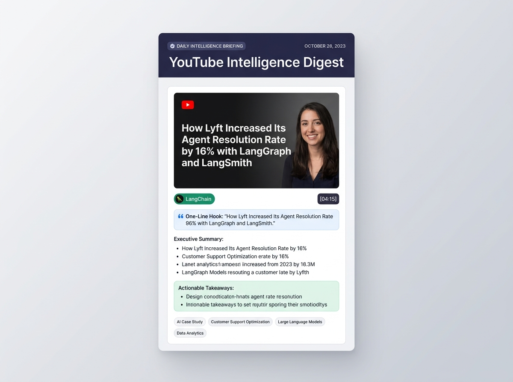
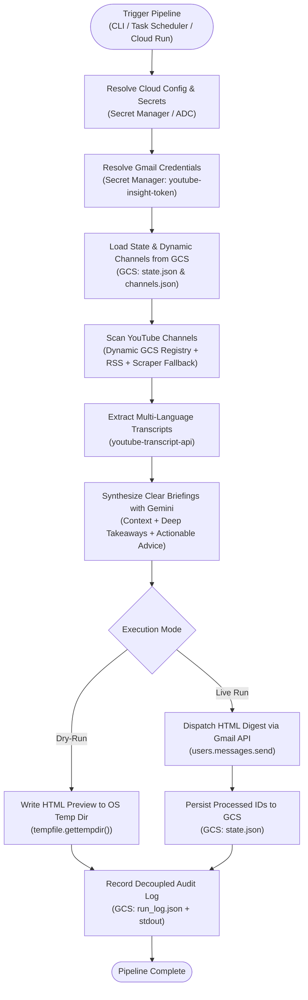
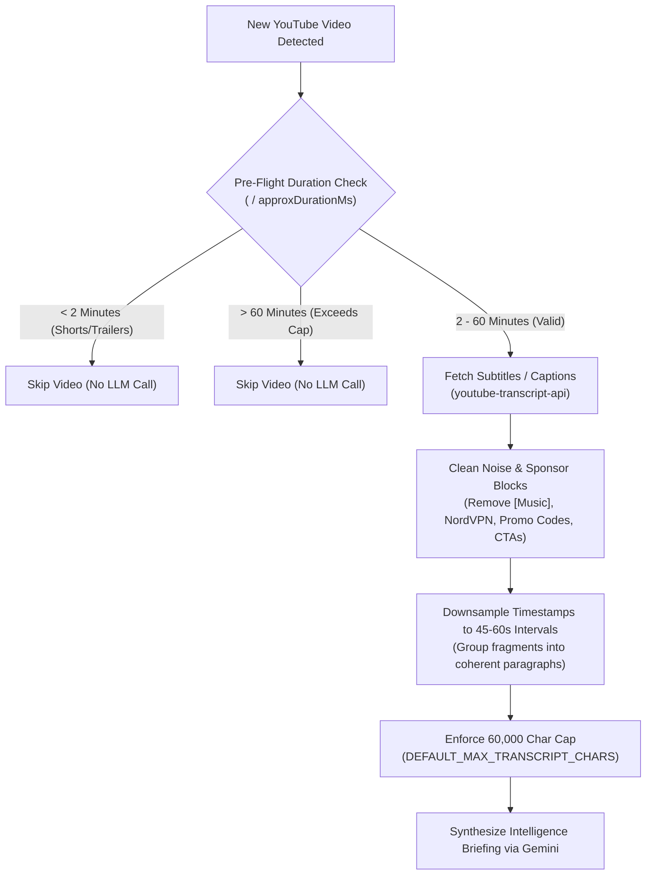

# YouTube Insight Digest 📺🤖📬

[](https://www.python.org/downloads/)
[](https://ai.google.dev/)
[](https://developers.google.com/gmail/api)
[](https://cloud.google.com/)
[](https://cloud.google.com/run)
[](LICENSE)

An automated intelligence system that monitors premier YouTube technical and startup channels (**AI Engineer**, **LangChain**, **SuperDataScience**, **AWS Developers**, **How I AI**, **Y Combinator**), extracts video transcripts and metadata, synthesizes crystal-clear, self-contained executive briefings using **Google Gemini**, and dispatches a responsive HTML digest to your **Gmail** every day at **12:00 PM Japan Standard Time (JST)**.

Built on a **Cloud-Native, Multi-PC Portable Architecture** using **Google Cloud Secret Manager** and **Google Cloud Storage (GCS)**, featuring **Dynamic Zero-Downtime Channel Sync** and zero local credential or state file dependencies.

---

## 📬 Sample Email Digest Preview

Here is an example of the high-signal, self-contained intelligence briefing delivered directly to your inbox every day at 12:00 PM JST. Each video card is structured so that you can fully understand the core breakthroughs, context, and lessons learned without needing to watch the video:

<p align="center">
  
</p>

<details open>
<summary><b>🔍 View Rendered Briefing Card Structure</b></summary>

<br/>

> ### 🟢 LangChain &bull; *LLM Agents & Frameworks*
> **[How Lyft Increased Its Agent Resolution Rate by 16% with LangSmith and LangGraph](https://www.youtube.com/watch?v=M9BMTC8o9-w)**
>
> `💡 One-Line Hook`
> **Lyft increased customer resolution rates by 16% and slashed agent deployment from six months to two weeks using LangGraph and LangSmith.**
>
> **Context & Problem:**
> Customer support queries at Lyft were overwhelming human agents, but their initial monolithic LLM prompt was too brittle, hallucinated policies, and took engineering teams months to update for minor edge cases.
>
> **Key Takeaways & What You Need to Know:**
> - **Modular Multi-Agent Architecture:** Replaced brittle monolithic prompts with a dynamic meta-agent architecture registering domain-specific sub-agents as LangGraph nodes. Each agent owns a single domain (e.g. lost items, fare disputes), preventing cross-domain hallucinations.
> - **Prompt Decoupling via LangSmith Hub:** Decoupled prompt engineering from application code using LangSmith Prompt Hub. Product managers and operations teams can now update, evaluate, and ship production agent behaviors through config updates in hours instead of weeks.
> - **Full-Trace Failure Isolation:** Integrated LangSmith distributed tracing across 200k–300k daily queries. This allowed engineering to pinpoint exact tool-call failures, step latency bottlenecks, and retrieval misses in multi-turn interactions.
>
> > **Actionable Advice:**
> > Decouple agent workflows into config-driven LangGraph nodes and centralized prompt hubs to empower domain experts and accelerate deployment cycles.
>
> **Key Moment:** `[04:15]` Architecture migration breakdown &bull; `Tags:` `#LangGraph` `#MultiAgent` `#LangSmith`

</details>

---

## ☁️ Multi-PC Cloud-Native Architecture

This repository is architected for zero-setup execution across multiple workstations (Windows, macOS, Linux) and headless Google Cloud Run containers without maintaining local secret files:

| Layer | Target Cloud Service | Purpose & Storage Format | Multi-PC Resolution Strategy |
| :--- | :--- | :--- | :--- |
| **API Keys & Secrets** (`GEMINI_API_KEY`, etc.) | **Google Cloud Secret Manager** | Secure string (`secrets/<id>/versions/latest`) | Python SDK with fallback to `gcloud secrets versions access` |
| **OAuth Tokens** (`token.json`) | **Google Cloud Secret Manager** | Serialized JSON token with refresh credentials (`youtube-insight-token`) | Auto-fetched when missing; auto-refreshed in-memory and synchronized back to Secret Manager |
| **OAuth Client IDs** (`credentials.json`) | **Google Cloud Secret Manager** | Raw client secrets JSON (shared `gmail-oauth-credentials`) | Auto-downloaded on demand from Secret Manager only if interactive web login is triggered |
| **Recipient Email** (`RECIPIENT_EMAIL`) | **Google Cloud Run Environment** | Plaintext email address (`RECIPIENT_EMAIL`) | Injected directly via Cloud Run environment variable to conserve Secret Manager free-tier slots |
| **Channel Registry** (`channels.json`) | **Google Cloud Storage (GCS)** | `gs://<project-id>-monitor-data/youtube-insight-digest/channels.json` | Dynamic runtime resolution on Cloud Run with instant local fallback; zero-downtime updates |
| **Persistent State / Memory** (`state.json`) | **Google Cloud Storage (GCS)** | `gs://<project-id>-monitor-data/youtube-insight-digest/state.json` (`asia-northeast1`) | Canonical source of truth; regional bucket in Tokyo; local runs write fallbacks strictly to OS temp dir (`tempfile.gettempdir()`) |
| **Execution & Audit Logs** (`run_log.json`) | **Google Cloud Storage & Cloud Logging** | `gs://<project-id>-monitor-data/youtube-insight-digest/run_log.json` + `stdout` | Decoupled from state; structured JSON streamed to Cloud Logging on Cloud Run |

---

## 🌟 Key Highlights

- **Dynamic Zero-Downtime Channel Sync**: Channels can be added, disabled, or updated dynamically in Google Cloud Storage. Cloud Run picks up changes immediately without needing container rebuilds or redeployments.
- **Crystal-Clear, Context-Rich Briefings**: Unlike generic summaries that produce cryptic bullet points, the Gemini intelligence engine explains the *problem context*, *how the solution works*, and *concrete findings* so you fully grasp the lessons without watching the video.
- **Multi-PC Portability**: Any machine with `gcloud auth login` can run the pipeline immediately with zero local `.env`, `credentials.json`, or `token.json` files.
- **Strict Secret Manager Cost Hygiene**: Automatically purges superseded token versions whenever OAuth credentials refresh, strictly enforcing single-version retention within the GCP free tier.
- **Dual-Mode Fallback**: All cloud integrations attempt the Python Google Cloud SDK first, gracefully falling back to authenticated `gcloud` CLI commands.
- **Zero Workspace Litter**: Local state caching and dry-run preview files default strictly to the OS temporary directory (`tempfile.gettempdir()`), keeping the Git repository completely clean.
- **Quota-Free & High Reliability**: Monitors channels via public RSS feeds (`feedparser`) with automatic web-scraping fallback (`ytInitialData`) when YouTube throttles feeds.
- **Resilient Multi-Language Timestamp Ingestion**: Strict publication date verification with multilingual relative time parsing (English, Japanese, Korean, Simplified & Traditional Chinese) and livestream prefix stripping. Unverified dates are safely excluded to guarantee older videos never falsely appear as new uploads.
- **Direct Timestamp Video Linking**: Key moments dynamically compute second offsets and route the `▶ Watch on YouTube` button directly to the exact point in the video (`?t=...`).
- **Self-Healing Channel Resolver**: Auto-recovers canonical YouTube channel IDs dynamically from handles/URLs if a configured channel ID fails or returns 404.
- **Deep Multilingual Transcripts**: Extracts manual or auto-generated video captions with timestamps via `youtube-transcript-api` across English, Japanese, Korean, Chinese, and more.
- **Responsive Gmail Digest**: Clean typography, dynamic channel badge pills, embedded thumbnails, and cards optimized for mobile and desktop Gmail clients.
- **Decoupled Audit Logs**: Structured operational logs are streamed to `stdout` and persisted to Google Cloud Storage.

---

## 🏗️ Orchestration & Cloud Architecture


```mermaid
flowchart TD
    START(["Trigger Pipeline<br/>(CLI / Task Scheduler / Cloud Run)"]) --> CONFIG["Resolve Cloud Config & Secrets<br/>(Secret Manager / ADC)"]
    CONFIG --> GMAIL_AUTH["Resolve Gmail Credentials<br/>(Secret Manager: youtube-insight-token)"]

    GMAIL_AUTH --> CLOUD_SYNC["Load State & Dynamic Channels from GCS<br/>(GCS: state.json & channels.json)"]
    CLOUD_SYNC --> SCAN_CHANNELS["Scan YouTube Channels<br/>(Dynamic GCS Registry + RSS + Scraper Fallback)"]

    SCAN_CHANNELS --> EXTRACT_TRANSCRIPT["Extract Multi-Language Transcripts<br/>(youtube-transcript-api)"]
    EXTRACT_TRANSCRIPT --> GEMINI_SYNTH["Synthesize Clear Briefings with Gemini<br/>(Context + Deep Takeaways + Actionable Advice)"]

    GEMINI_SYNTH --> DISPATCH_DECISION{"Execution Mode"}
    DISPATCH_DECISION -- "Dry-Run" --> PREVIEW_OUT["Write HTML Preview to OS Temp Dir<br/>(tempfile.gettempdir())"]
    DISPATCH_DECISION -- "Live Run" --> GMAIL_SEND["Dispatch HTML Digest via Gmail API<br/>(users.messages.send)"]

    GMAIL_SEND --> SAVE_STATE["Persist Processed IDs to GCS<br/>(GCS: state.json)"]
    PREVIEW_OUT --> AUDIT_LOG["Record Decoupled Audit Log<br/>(GCS: run_log.json + stdout)"]
    SAVE_STATE --> AUDIT_LOG
    AUDIT_LOG --> FINISH(["Pipeline Complete"])
```

---

## 🏛️ Technical & Architectural Decisions

- **Dynamic Zero-Downtime Channel Sync via Google Cloud Storage**:
  - *Decision*: Decouple the monitored channel registry (`channels.json`) from the container image by resolving it dynamically from `gs://$BUCKET_NAME/youtube-insight-digest/channels.json` on every run, with automatic local fallback.
  - *Context & Motivation*: Updating, adding, or temporarily disabling monitored YouTube channels in standard serverless setups requires editing source code, rebuilding the container image (`gcloud builds submit`), and redeploying the Cloud Run service, consuming several minutes.
  - *Rationale & Alternatives Considered*: Ingesting `channels.json` dynamically from GCS allows operators to push channel updates in under 2 seconds (`sync_channels.ps1`) without touching compute instances or risking deployment failures.
  - *Consequences & Impact*: Zero-downtime instant channel management with resilient offline fallback to local defaults.

- **Self-Contained Executive Briefings over Shallow Bullet Summaries**:
  - *Decision*: Prompt Gemini 3.8 Flash to structure each video insight into an opening hook, explicit problem context, technical mechanism/takeaways, and actionable advice.
  - *Context & Motivation*: Generic video summaries generate superficial bullet points (*"discussed AI frameworks and showed a demo"*) that compel the practitioner to watch the entire 45-minute video anyway to extract actual technical value.
  - *Rationale & Alternatives Considered*: A structured multi-section briefing extracts specific architectural trade-offs, quantitative outcomes, and concrete engineering lessons, empowering senior engineers to fully understand the takeaways in under two minutes without watching the recording.
  - *Consequences & Impact*: True high-signal executive briefings that deliver complete knowledge transfer without requiring video playback.

- **Quota-Free Hybrid Discovery (Public RSS + `ytInitialData` Scraper Fallback)**:
  - *Decision*: Ingest new channel uploads via public YouTube channel XML RSS feeds, falling back to lightweight HTML `ytInitialData` extraction when RSS feeds are delayed or throttled.
  - *Context & Motivation*: The official YouTube Data API v3 enforces restrictive daily quota limits (10,000 units/day; channel list calls consume 100 units each), rapidly depleting quotas across frequent multi-channel scans.
  - *Rationale & Alternatives Considered*: Public RSS feeds consume zero quota units and require no developer API credentials. The scraper fallback handles intermittent feed latency.
  - *Consequences & Impact*: Zero API quota consumption and immunity to YouTube Data API daily rate exhaustion.

- **Multi-PC Portability via Secret Manager with Dual-Mode SDK & CLI Fallback**:
  - *Decision*: Resolve all API keys and OAuth tokens dynamically from Google Cloud Secret Manager at runtime, with automatic fallback from Python SDK ADC to the active `gcloud` CLI session.
  - *Context & Motivation*: Maintaining local `.env` and `token.json` files across multiple developer workstations (Windows desktop, laptop, Cloud Run container) causes credential drift and git exposure risks.
  - *Rationale & Alternatives Considered*: Secret Manager acts as the single source of truth. Any machine authenticated with `gcloud` can immediately execute the pipeline with zero local credential files.
  - *Consequences & Impact*: 100% portable zero-setup development and zero secret files stored in local workspaces.

---

## 📡 Pre-Configured Channels

| Channel | Handle | Category | Focus & Domain |
| :--- | :--- | :--- | :--- |
| **AI Engineer** | `@aiDotEngineer` | AI Engineering | AI Engineering, Latent Space talks, agent architectures |
| **LangChain** | `@LangChain` | LLM Frameworks | LangGraph, autonomous agents, evaluation frameworks |
| **SuperDataScience** | `@sds-superdatascience` | Data Science | Data science, machine learning models, industry interviews |
| **AWS Developers** | `@awsdevelopers` | Cloud & Infrastructure | Cloud infrastructure, serverless AI, Amazon Bedrock |
| **How I AI** | `@howiaipodcast` | AI Podcast & Interviews | AI podcasts, founder interviews, practical AI workflows |
| **Y Combinator** | `@ycombinator` | Startups & Tech Ecosystems | Startup advice, AI demos, founder insights, tech trends |

---

## ⚡ Google Cloud Storage (GCS) Dynamic Channel Sync

### The Core Advantage: Zero-Downtime Channel Management
In standard serverless deployments, modifying a channel list requires editing code, rebuilding the container image (`gcloud builds submit`), and redeploying the service (`gcloud run deploy`), which takes 2–4 minutes.

To eliminate this bottleneck, YouTube Insight Digest features **GCS Dynamic Channel Sync**:
- **Runtime Lookup**: On every scheduled trigger (e.g. daily at 12:00 PM JST), Cloud Run checks `gs://$BUCKET_NAME/youtube-insight-digest/channels.json` in Google Cloud Storage.
- **Instant Effect**: When the file exists in GCS, the cloud service immediately executes with that channel list.
- **Resilient Fallback**: If GCS is temporarily unreachable or unconfigured, Cloud Run automatically falls back to the bundled local [`channels.json`](channels.json).

### How to Update Channels Going Forward

#### Step 1: Update Local [`channels.json`](channels.json)
Add, edit, or disable any channel entry. For example:
```json
{
  "id": "ycombinator",
  "name": "Y Combinator",
  "handle": "@ycombinator",
  "channel_id": "UCcefcZRL2oaA_uBNeo5UOWg",
  "url": "https://www.youtube.com/@ycombinator",
  "category": "Startups & Tech Ecosystems",
  "badge_color": "#ff6600",
  "enabled": true
}
```
> [!NOTE]
> If you don't know the internal YouTube `channel_id`, you can leave it blank (`""`)! The system automatically resolves `@handles` and channel URLs to the canonical YouTube channel ID on first run.

#### Step 2: Push to Cloud Storage (Takes 2 Seconds)
You can synchronize the new configuration to GCS using any of the following methods:

**Method A: Dedicated PowerShell Script (Recommended for Windows)**
```powershell
.\deployment\sync_channels.ps1
```

**Method B: Python CLI (Cross-Platform)**
```bash
py -3.11 -m src.main --sync-channels
```

**Method C: Direct `gcloud storage` CLI**
```bash
gcloud storage cp channels.json gs://<your-project-id>-monitor-data/youtube-insight-digest/channels.json
```

That's it! Your next scheduled Cloud Run pipeline execution will immediately begin monitoring the new channels with zero container rebuilds or service interruptions.

---

## 📁 Repository Structure

```
youtube-insight-digest/
├── channels.json              # Channel configurations (handles, categories, badges)
├── requirements.txt           # Application dependencies (including Google Cloud SDKs)
├── Dockerfile                 # Production container image (zero baked secrets)
├── run_digest.bat             # Windows one-click execution & task scheduler batch file
├── README.md                  # Project documentation & operational reference
├── .gitignore                 # Excludes secrets, tokens, local states, and caches
├── .gcloudignore              # Cloud Build packaging ignore rules
├── deployment/
│   ├── deploy_cloud.ps1       # Automated Google Cloud Run & Cloud Scheduler deployment script
│   └── sync_channels.ps1      # Instant zero-downtime channels sync to Cloud Storage
├── src/
│   ├── __init__.py            # Package indicator
│   ├── app.py                 # Flask web service for Cloud Run / webhook triggers
│   ├── auth.py                # Cloud-native Gmail OAuth flow & Secret Manager token sync
│   ├── config.py              # Dynamic Secret Manager resolution & cloud configurations
│   ├── email_sender.py        # Responsive HTML email builder & Gmail API dispatcher
│   ├── main.py                # CLI pipeline orchestrator & dry-run runner
│   ├── storage.py             # Google Cloud Storage state, dynamic channels & audit logging
│   ├── summarizer.py          # Google Gemini structured synthesis & insight generation
│   ├── sync_secrets.py        # One-shot secret & state synchronization utility
│   ├── transcript_fetcher.py  # Subtitle extraction & timestamp alignment
│   └── youtube_monitor.py     # Channel handle resolver, RSS parser & dynamic cloud loading
```

---

## 🚀 Quickstart Guide

### 1. Zero-Setup Onboarding on Any Machine
On any machine with `gcloud` authenticated, simply clone and run:

```bash
# 1. Clone repository
git clone https://github.com/<owner>/youtube-insight-digest.git
cd youtube-insight-digest

# 2. Install dependencies
py -3.11 -m pip install -r requirements.txt

# 3. Authenticate with Google Cloud
gcloud auth login
gcloud auth application-default login
gcloud config set project <your-gcp-project-id>

# 4. Run test dry-run immediately (Zero local credentials required!)
py -3.11 -m src.main --dry-run
```

### 2. Synchronizing Local Credentials to the Cloud (One-Time)
If you have local `token.json`, `credentials.json`, or `.env` files and want to synchronize them to Google Cloud Secret Manager and Google Cloud Storage in one shot:

```bash
py -3.11 -m src.sync_secrets
```
Once synchronized, local credentials can be deleted from the workspace to maintain complete hygiene.

---

## 🧪 Testing & Execution

### Test in Dry-Run Mode (No Email Sent)
Scans channels, fetches transcripts, synthesizes insights with Gemini, and writes a rendered HTML preview to the OS temporary directory (`tempfile.gettempdir()`):
```bash
py -3.11 -m src.main --dry-run
```

### Live Run (Scan & Dispatch Email)
```bash
py -3.11 -m src.main
```

### Sync Monitored Channels to Cloud Storage (Zero-Downtime)
Uploads local `channels.json` directly to GCS so Cloud Run picks up changes immediately:
```bash
py -3.11 -m src.main --sync-channels
# or
.\deployment\sync_channels.ps1
```

### Establish Clean Baseline State (First Run / New Channels)
Seeds all current videos across all monitored channels directly into state tracking without synthesizing summaries or dispatching emails. Ensures that newly added channels will only trigger digests for videos released *after* this baseline is created:
```bash
py -3.11 -m src.main --seed-state
```

### Filter by Specific Channel
```bash
py -3.11 -m src.main --channel @ycombinator --dry-run
```

### Custom Lookback Window
```bash
# Check videos published in the past 48 hours
py -3.11 -m src.main --hours 48
```

### Force Re-Processing (Bypass State Filtering)
```bash
py -3.11 -m src.main --force --dry-run
```

---

## ⏰ Daily Scheduling at 12:00 PM JST

### Method A: Windows Task Scheduler (Recommended for Local Machine)
Register a daily scheduled task using the provided [`run_digest.bat`](run_digest.bat):

```powershell
schtasks /Create /TN "YouTubeInsightDigest" /TR "\"c:\Users\hyunwookim\OneDrive - GAFS\ドキュメント\GitHub\youtube-insight-digest\run_digest.bat\"" /SC DAILY /ST 12:00
```

### Method B: Google Cloud Run & Cloud Scheduler (Serverless Production)
Deploy the system as an automated, serverless microservice on **Google Cloud Run** triggered daily at **12:00 PM JST** by **Cloud Scheduler** over authenticated HTTPS.

The container image contains **no baked-in secrets or tokens**; it securely resolves credentials from Secret Manager and persists state directly to Google Cloud Storage.

```powershell
# Standard deployment (defaults to asia-northeast1, 12:00 PM JST):
.\deployment\deploy_cloud.ps1

# Or with explicit parameters:
.\deployment\deploy_cloud.ps1 -ProjectId "<your-gcp-project-id>" -Region "asia-northeast1" -Schedule "0 12 * * *" -TimeZone "Asia/Tokyo"
```

### Verification & Logs

Check execution logs or manually trigger the Cloud Run service:

```powershell
# Tail Cloud Run logs:
gcloud beta run services logs tail youtube-insight-digest --region=asia-northeast1

# Manually trigger via Cloud Scheduler:
gcloud scheduler jobs run youtube-insight-daily-trigger --location=asia-northeast1
```

---

## ⚡ Intelligent Token & Duration Optimization

To optimize LLM consumption costs and ensure maximum signal-to-noise ratio, the pipeline features a multi-tiered ingestion filter:


```mermaid
flowchart TD
    VID["New YouTube Video Detected"] --> DURATION_CHECK{"Pre-Flight Duration Check<br/>(<meta itemprop='duration'> / approxDurationMs)"}
    DURATION_CHECK -- "< 2 Minutes (Shorts/Trailers)" --> SKIP_SHORT["Skip Video (No LLM Call)"]
    DURATION_CHECK -- "> 60 Minutes (Exceeds Cap)" --> SKIP_LONG["Skip Video (No LLM Call)"]
    DURATION_CHECK -- "2 - 60 Minutes (Valid)" --> FETCH_TRANSCRIPT["Fetch Subtitles / Captions<br/>(youtube-transcript-api)"]
    
    FETCH_TRANSCRIPT --> CLEAN_TRANSCRIPT["Clean Noise & Sponsor Blocks<br/>(Remove [Music], NordVPN, Promo Codes, CTAs)"]
    CLEAN_TRANSCRIPT --> COMPACT_PARAGRAPHS["Downsample Timestamps to 45-60s Intervals<br/>(Group fragments into coherent paragraphs)"]
    COMPACT_PARAGRAPHS --> CHAR_CAP["Enforce 60,000 Char Cap<br/>(DEFAULT_MAX_TRANSCRIPT_CHARS)"]
    CHAR_CAP --> GEMINI_CALL["Synthesize Intelligence Briefing via Gemini"]
```

1. **Pre-Flight Video Duration Gating**:
   - Inspects video metadata (`<meta itemprop="duration">` or `approxDurationMs`) before invoking transcription.
   - Ignores videos shorter than 2 minutes (shorts, trailers, teaser clips) or longer than 1 hour (unless `MIN_VIDEO_DURATION_SECONDS` / `MAX_VIDEO_DURATION_SECONDS` are configured), preventing wasteful processing of non-digestible videos.
2. **Transcript Downsampling & Compaction**:
   - Replaces noisy, line-by-line fragments with coherent 45–60s interval paragraphs prefixed by clean timestamp labels (`[MM:SS]`).
   - Cuts structural newline and fragmentation overhead by ~75% while maintaining precise milestone traceability.
3. **Automated Sponsor & Filler Pruning**:
   - Regex-based pruning removes recurring sponsor pitches (e.g., *NordVPN, Skillshare, Squarespace, Brilliant, BetterHelp*, promo codes, affiliate links), call-to-action clutter (*"smash that like button"*), and subtitle noise markers (`[Music]`, `[Applause]`).
4. **Optimized Character Ceiling**:
   - Reduced the transcript truncation cap from 180,000 characters to **60,000 characters** (`DEFAULT_MAX_TRANSCRIPT_CHARS`), which comfortably encompasses an entire 60-minute technical talk while saving up to 66% in peak prompt token costs.

---

## 🏛️ Architectural Decision Records (ADR)

- **ADR-001: Pre-Transcription Duration Filtering**: Checking duration via public HTML headers before calling transcription endpoints prevents unneeded API calls and eliminates LLM consumption for shorts, trailers, and multi-hour live streams.
- **ADR-002: Timestamp Downsampling into Paragraphs**: Grouping subtitles into 45–60 second intervals preserves temporal accuracy for key moment citations while delivering significantly better context to Gemini than fragmented 2-second subtitle chunks.
- **ADR-003: Deterministic Regex Cleaning for Sponsor Blocks**: Eliminates sponsor advertisements before prompt submission, saving tokens and guaranteeing that Gemini does not inadvertently treat promotional offers as technical breakthroughs.

---

## 🛡️ Security & Clean Workspace Hygiene

- **Zero Local Secrets**: No secrets, tokens, or environment files (`.env`, `credentials.json`, `token.json`) are stored in the repository.
- **Strict Exclusion**: [`.gitignore`](.gitignore) and [`.gcloudignore`](.gcloudignore) ensure no local state or cache files are ever committed or bundled into container builds.
- **Audit Logs**: All executions record structured audit logs into Google Cloud Storage (`gs://<bucket>/youtube-insight-digest/run_log.json`) and stream to Cloud Logging.
- **IAM Authorization**: Cloud Run services are protected with `--no-allow-unauthenticated` and invoked only by dedicated service accounts with `roles/run.invoker`.
